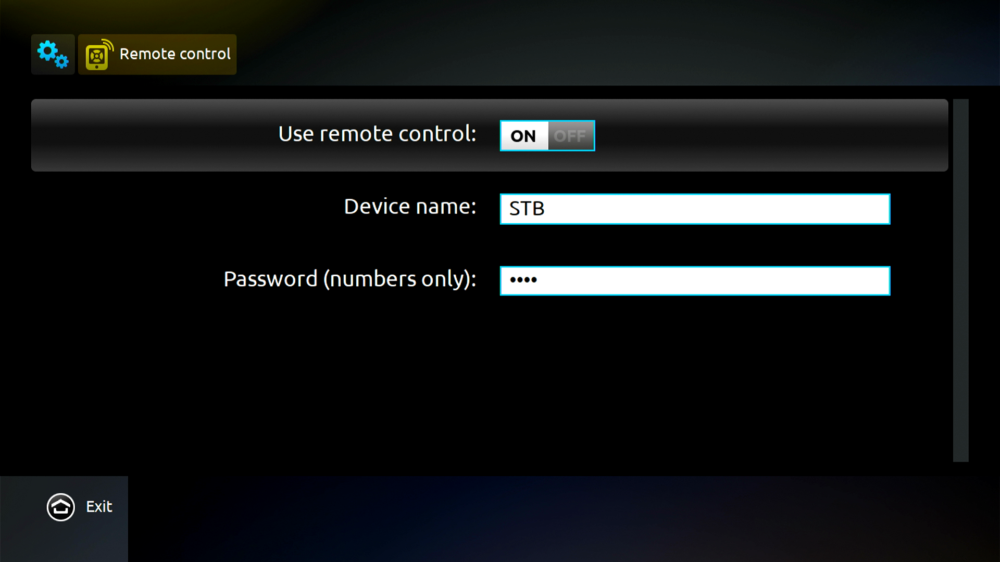
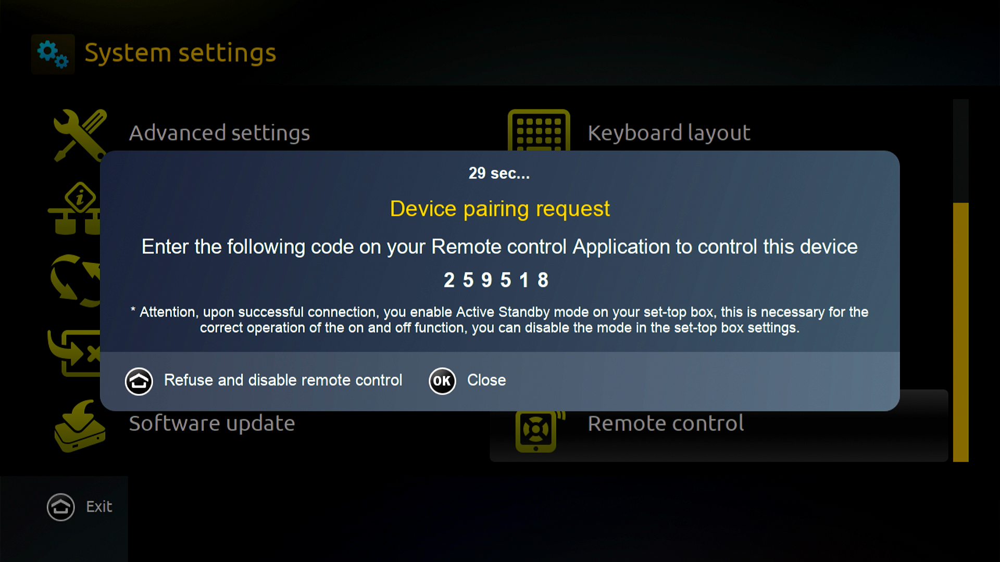

# Overview

This is an open-source remote control for [MAG](https://www.infomir.eu/eng/products/iptv-stb/) set-top boxes.
It has the same functionality as the "MAGic Remote" app for [Android](https://play.google.com/store/apps/details?id=com.infomir.magicRemote&hl=en) and [iOS](https://apps.apple.com/us/app/magic-remote-tv-remote-control/id972015388).

You can find more info about how it works in this [blog post](https://xakcop.com/post/magic-remote/).

# Installation

The application is written in Python3 and uses the `pycryptodomex` and `pynput` libraries. Install them with:

```
$ pip install -r requirements.txt
```

For `pynput` you may also need to install `python3-dev` first:

```
$ sudo apt install python3-dev
```

# Usage

First you need to enable "User remote control" on your MAG in `Main menu ==> Settings ==> System Settings ==> Remote control`.
You can ignore "Device name" and "Password".



Then you can pair the MAG with the following command (`192.168.88.41` is the IP address of the MAG):

```
$ ./magic-remote.py pair 192.168.88.41
Enter pairing code displayed on TV:
```

You should get a 6 digit pairing code on your TV like this:



Enter this code on the console to complete the pairing process.

Now you can use this pairing code to send commands to your MAG.
For example, to send the `UP` key which has `rc_code=189` use:

```
$ ./magic-remote.py send-key 192.168.88.41 259518 189
```

You can find the RC codes for all buttons in this table:

| Button      | RC code | Kbd key   |
| ----------- | ------- | ----------|
| UP          | 189     | up        |
| DOWN        | 190     | down      |
| LEFT        | 191     | left      |
| RIGHT       | 171     | right     |
| OK          | 172     | enter     |
| HOME        | 141     | escape    |
| BACK        | 143     | backspace |
| VOLUME UP   | 146     | plus      |
| VOLUME DOWN | 147     | minus     |
| CHANNEL UP  | 188     | page up   |
| CHANNEL DOWN| 145     | page down |
| INFO        | 157     | i         |
| MUTE        | 176     | m         |
| REWIND      | 150     | b         |
| FAST FWD    | 144     | f         |
| PLAY/PAUSE  | 139     | p         |
| TV          | 138     | t         |
| F1          | 178     | f1        |
| F2          | 177     | f2        |
| F3          | 185     | f3        |
| F4          | 186     | f4        |
| 0-9         | 128-137 | 0-9       |
| POWER       | 140     | o         |

Instead of sending single keys, you can also use your keyboard as input:

```
$ ./magic-remote.py input 192.168.88.41 259518
```

The mapping between keyboard keys and MAG buttons is in the table above.

Finally, you can also send text strings with the `send-text` command:

```
$ ./magic-remote.py send-text 192.168.88.41 259518 'http://example.com'
```

Enjoy!
